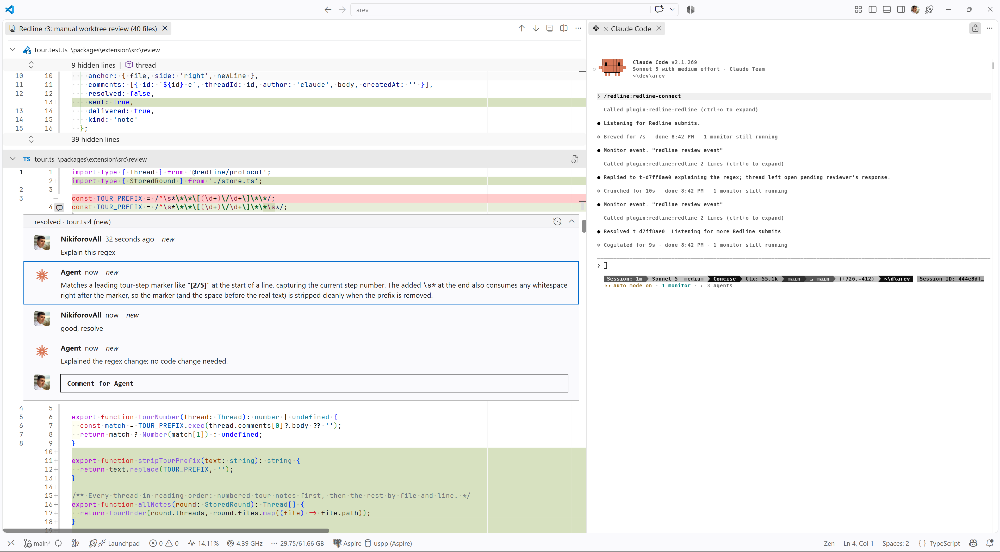

# Redline

Redline is a two-way code review tool for Claude Code and VS Code. Claude posts its review of a diff as comment threads on the lines in VS Code. You answer, add your own threads, and click Submit. Claude works through every thread, edits the code, and replies in place until you close it.


The [docs site](https://nikiforovall.blog/redline/) has a [guide](https://nikiforovall.blog/redline/guide) that walks one round end to end and a [reference](https://nikiforovall.blog/redline/reference) for every command, shortcut, setting, MCP tool, and error text.



## Install

Search for **Redline** in the VS Code Extensions view, or:

```sh
code --install-extension nikiforovall.redline-extension
```

The extension opens a **Get started with Redline** walkthrough. Its first step installs the Claude Code plugin with one button, which runs these in a terminal:

```
claude plugin marketplace add nikiforovall/redline
claude plugin install redline@redline
```

The same two commands work as `/plugin marketplace add nikiforovall/redline` and `/plugin install redline@redline` inside a Claude Code session. Start a new session afterwards so it loads the skills. VS Code keeps the extension updated.

## Skills

| Skill                        | Does                                                                                                                                                                 |
| ---------------------------- | -------------------------------------------------------------------------------------------------------------------------------------------------------------------- |
| `/redline:redline-tour`      | Opens Claude's diff as a round with a numbered walkthrough: Claude picks the parts a reader must understand and notes each one, in reading order. Then listens for your submit. |
| `/redline:redline-annotate`  | Opens the diff with only the notes Claude already wrote for you in chat, or none. Then listens.                                                                      |
| `/redline:redline-connect`   | Attaches the session to submits from VS Code. Run it after **Compare…** in VS Code, or when a submit message says no agent is connected.                  |

The round skills take an optional source: `staged`, `unstaged`, `all`, a ref or range such as `main` or `a..b`, a `.patch` file, or `--files <left> <right>`.

## Shortcuts

Every shortcut is a chord behind `Ctrl+Alt+R` (`Cmd+Alt+R` on macOS). Press the leader, release, then the key.

| Keys                        | Command                                       |
| --------------------------- | --------------------------------------------- |
| `Ctrl+Alt+R O`              | Open latest round                             |
| `Ctrl+Alt+R H`              | Open a round from history                     |
| `Ctrl+Alt+R S`              | Submit review                                 |
| `Ctrl+Alt+]` / `Ctrl+Alt+[` | Next / previous note (no leader)              |
| `Ctrl+Alt+R Enter`          | Send the thread under the cursor to the agent |
| `Ctrl+Alt+R R`              | Resolve or reopen the thread under the cursor |

Thread shortcuts act on the thread nearest the cursor in the active diff, else on the note you last stepped to.

## Packages

| Package                  | What it holds                                                                                                                                                                      |
| ------------------------ | ---------------------------------------------------------------------------------------------------------------------------------------------------------------------------------- |
| `packages/extension`     | The VS Code extension: renders the review round and collects comment threads.                                                                                                      |
| `packages/mcp`           | The MCP server, the review monitor, and the lock-file discovery both sides share. On npm as `@nikiforovall/redline-mcp`, bin `redline-mcp`.                                        |
| `packages/claude-plugin` | The Claude Code plugin: the three skills above, the monitor registration, and a launcher that finds the server in a checkout, on PATH, or through npx.                            |
| `packages/protocol`      | The shared TypeScript types.                                                                                                                                                       |

## Privacy

Redline is local only. The two halves talk over `127.0.0.1` with a random token kept in a lock file under `~/.redline/`. Rounds and comments stay in VS Code's workspace storage. There is no telemetry. The one optional network call loads your GitHub avatar for your comments, from the account VS Code is already signed in with. Set `redline.avatar` to `none` to turn it off.

## Develop

[docs/DEVELOPMENT.md](docs/DEVELOPMENT.md) covers the build, the edit loops for each half, and the real-install paths. [docs/PUBLISHING.md](docs/PUBLISHING.md) covers versioning and `npm run release`.
