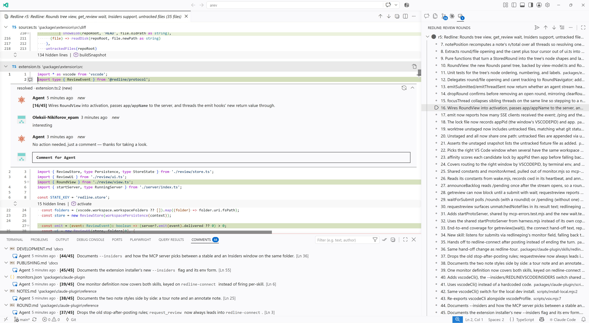

# Redline

Redline is a code review tool for Claude Code and VS Code. Claude Code collects the changes it just made, opens them as a multi-file diff in VS Code with its own notes attached, and waits. You read the diff, leave comments on the lines you care about, and click Submit. Claude wakes with those comments and edits the code.




## Install

Plugin, from Claude Code:

```
/plugin marketplace add nikiforovall/redline
/plugin install redline@redline
```

Extension, from a shell with `code` on PATH and `gh` signed in to the repo:

```sh
node ~/.claude/plugins/cache/redline/redline/<version>/scripts/install-extension.mjs [--profile <name>]
```

The plugin does nothing without the extension. Rerun the script to update it; a plugin update does not update the extension.

## Shortcuts

Every shortcut is a chord behind `Ctrl+Alt+R` (`Cmd+Alt+R` on macOS). Press the leader, release, then the key.

| Keys                        | Command                                       |
| --------------------------- | --------------------------------------------- |
| `Ctrl+Alt+R O`              | Open latest round                             |
| `Ctrl+Alt+R H`              | Open a round from history                     |
| `Ctrl+Alt+R S`              | Submit review                                 |
| `Ctrl+Alt+]` / `Ctrl+Alt+[` | Next / previous note (no leader)              |
| `Ctrl+Alt+R Enter`          | Send the thread under the cursor to the agent |
| `Ctrl+Alt+R R`              | Resolve or reopen the thread under the cursor |

Thread shortcuts act on the thread nearest the cursor in the active diff, else on the note you last stepped to.

## Packages

| Package                  | What it holds                                                                                                                                                                      |
| ------------------------ | ---------------------------------------------------------------------------------------------------------------------------------------------------------------------------------- |
| `packages/extension`     | The VS Code extension: renders the review round and collects comment threads.                                                                                                      |
| `packages/mcp`           | The MCP server, the review monitor, and the lock-file discovery both sides share. On npm as `@nikiforovall/redline-mcp`, bin `redline-mcp`.                                        |
| `packages/claude-plugin` | The Claude Code plugin: the `/redline-annotate` and `/redline-tour` skills, the monitor registration, and a launcher that finds the server in a checkout, on PATH, or through npx. |
| `packages/protocol`      | The shared TypeScript types.                                                                                                                                                       |

## Develop

```sh
npm install
npm run build
npm test
npm run install:local [-- --profile <name>]   # build, package, and install the extension into VS Code
claude --plugin-dir packages/claude-plugin     # load the plugin from source
npm link -w @nikiforovall/redline-mcp          # let an installed plugin run the server from this checkout
```

[docs/DEVELOPMENT.md](docs/DEVELOPMENT.md) covers the edit loops (F5 dev host, `--plugin-dir`) and the real-install paths (`.vsix`, local directory marketplace) for each half. [docs/PUBLISHING.md](docs/PUBLISHING.md) covers versioning, `npm run release`, and what changes when the repo goes public.
